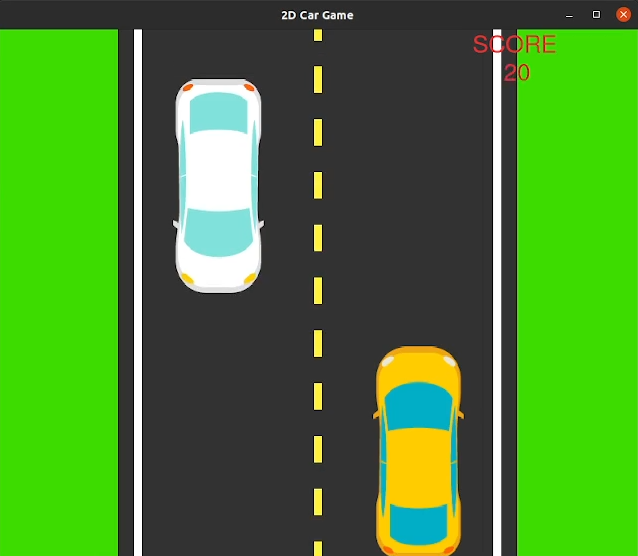
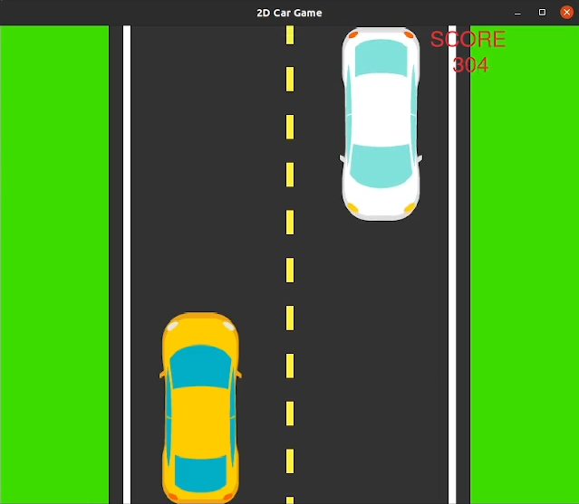

# Pygame: Racing Car

Welcome to the Pygame Racing Car project, a collaborative effort to improve a fun and engaging racing car game built using the Pygame library. This project is open to anyone who wants to contribute to making the game better.

     

## Getting Started

To get started, clone the repository and review the code to familiarize yourself with the game's structure and functionality. If you're new to Pygame or game development in general, don't worry - this project is beginner-friendly and offers a great opportunity to learn by doing.

## Screenshots

&nbsp; &nbsp; &nbsp; &nbsp;

## Contributing

Contributions are welcome and encouraged! Whether you're a seasoned Python developer or just getting started, there are many ways to contribute to this project. You can help by adding new features, improving the game's graphics, fixing bugs, or simply testing the game and providing feedback.

If you are interested in learning Pygame, [checkout the official documentation](https://www.pygame.org/docs/)

## Issues and Feedback

If you encounter any issues or have feedback on how we can make the game better, please let us know by opening an issue in the repository. We appreciate your input and look forward to working with you to make Pygame Racing Car the best it can be!
